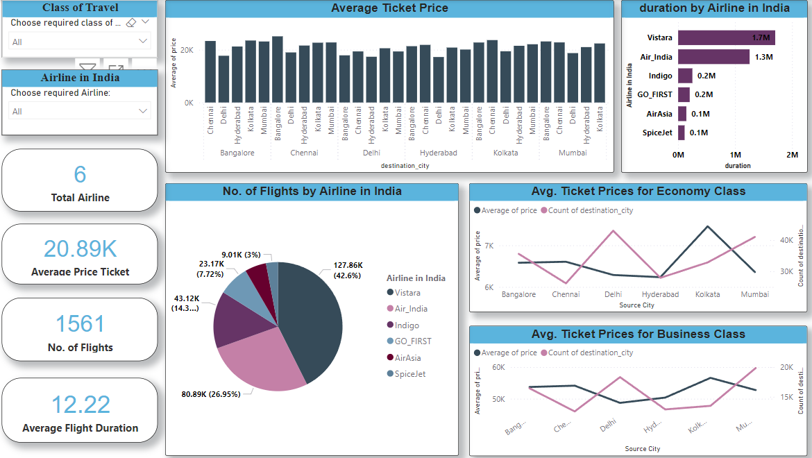

# Airlines Analysis - India

A comprehensive analysis of the Indian airline industry.

## DETAILS PROVIDED IN THE .DOCX FILES

The detailed information and analysis are available in the provided .DOCX files.

# Power BI Dashboard

A dashboard has been included for data visualization purposes.

# Conclusion

1) **'Air Asia'** offers the lowest fares for Economy class, while **'Air India'** provides the best prices for Business class.
2) Booking tickets 3-7 weeks prior to your travel date tends to be more cost-effective than purchasing them within 3 weeks of departure, as prices surge significantly in the 2-20 day range. Tickets purchased just one day before the flight may still be affordable, but generally not as low as those bought over 3 weeks in advance.
3) Ticket prices generally increase with the duration of the flight, peaking at around 20 hours. However, there are some exceptions, with prices dropping slightly for flights exceeding 20 hours. This relationship can be approximated by a quadratic curve.
4) Flights departing late at night or arriving early in the morning (or late at night) are typically the most affordable.
5) The cost of flights rises as the number of layovers increases.
6) **Delhi** offers the most economical flights, while **Hyderabad** is the most expensive city to fly to.

